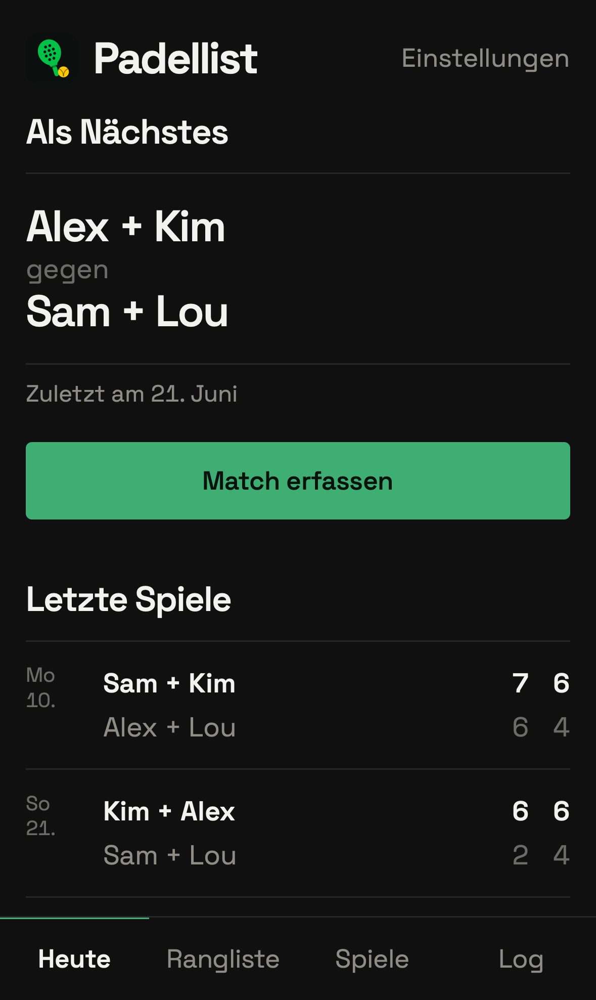
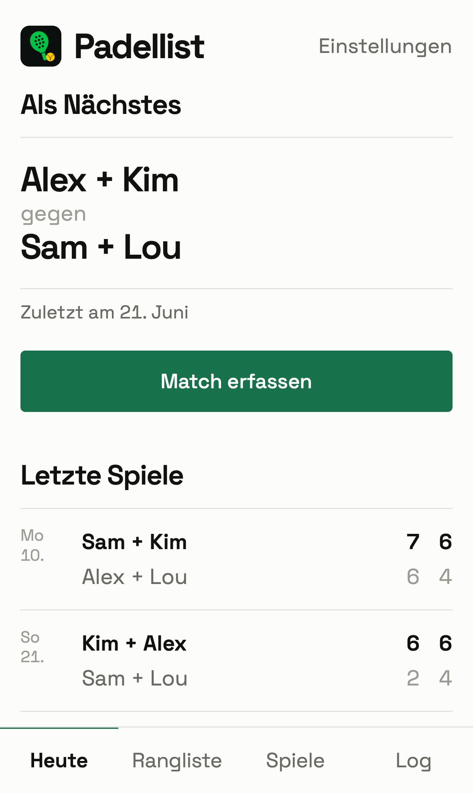

<p align="center">
  
</p>

<h1 align="center">Padellist</h1>

<p align="center">
  Rangliste, Statistik und Rotation für unsere wöchentliche Padel-Runde.<br>
  Eine PWA, gebaut für genau vier Spieler.
</p>

<p align="center">
  <a href="https://github.com/tovoro/padellist/actions/workflows/ci.yml"></a>
  <a href="LICENSE"></a>
  
</p>

<p align="center">
  
  &nbsp;
  
</p>

## Was es kann

- **Rangliste** — Siegquote, Satzbilanz, Spieldifferenz und Formkurve
- **Duos & direkte Duelle** — wer mit wem harmoniert, welche Aufteilung dominiert
- **Rotation** — schlägt die Aufteilung vor, die am längsten nicht gespielt wurde
- **Match in 15 Sekunden erfasst** — drei Paarungs-Buttons, Stepper statt Tastatur
- **Log** — jede Änderung für alle sichtbar, gelöschte Spiele bleiben rekonstruierbar
- **Offline lesbar** — der letzte Stand ist auch ohne Empfang in der Halle da
- **Ein gemeinsames Passwort** — keine Konten, die Session hält 180 Tage

## Stack

Bewusst langweilig: Vite, React 19, TypeScript (strict) und Tailwind 4 auf
Cloudflare Pages, Daten in D1 (SQLite). Laufzeit-Abhängigkeiten: `react` und
`react-dom` — sonst nichts. Kein Router, kein ORM, keine Component-Library.

Details und Architektur-Entscheidungen: [CLAUDE.md](CLAUDE.md)

## Lokal entwickeln

```
npm install
cp .dev.vars.example .dev.vars
npm run db:apply
npm run dev:api     # Pages Functions + lokale D1 auf :8788
npm run dev         # Vite auf :5173, leitet /api weiter
```

Login mit dem Passwort aus `.dev.vars` (Standard: `padel`).
`npm test` prüft Statistik und Rotation, `npm run typecheck` App und Functions.

## Deployment

```
npx wrangler login
npx wrangler d1 create padellist        # id in wrangler.toml eintragen
npx wrangler pages project create padellist
npm run db:apply:remote
npx wrangler pages secret put APP_PASSWORD
npx wrangler pages secret put SESSION_SECRET
npm run deploy
```

`SESSION_SECRET` ist ein beliebiger langer Zufallswert, z. B. aus
`openssl rand -base64 32`.

Danach deployt jeder Push auf `main` automatisch über GitHub Actions
(Tests, Typecheck, D1-Migrationen, Pages-Deploy). Der Workflow braucht zwei
Repo-Secrets: `CLOUDFLARE_ACCOUNT_ID` und `CLOUDFLARE_API_TOKEN`
(Token mit *Cloudflare Pages: Edit* und *D1: Edit*).

## Lizenz

[MIT](LICENSE)
